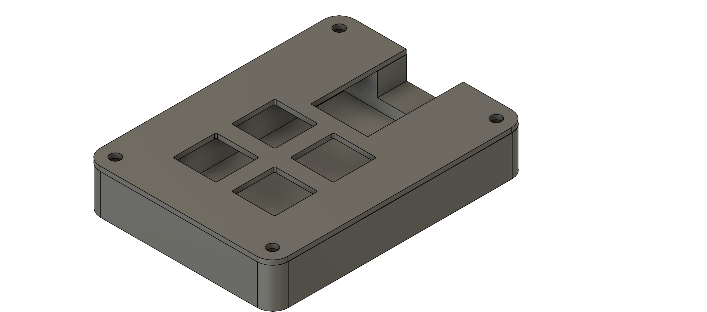
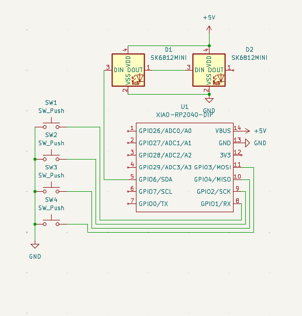
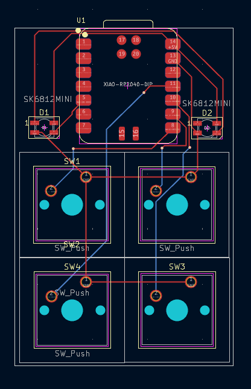
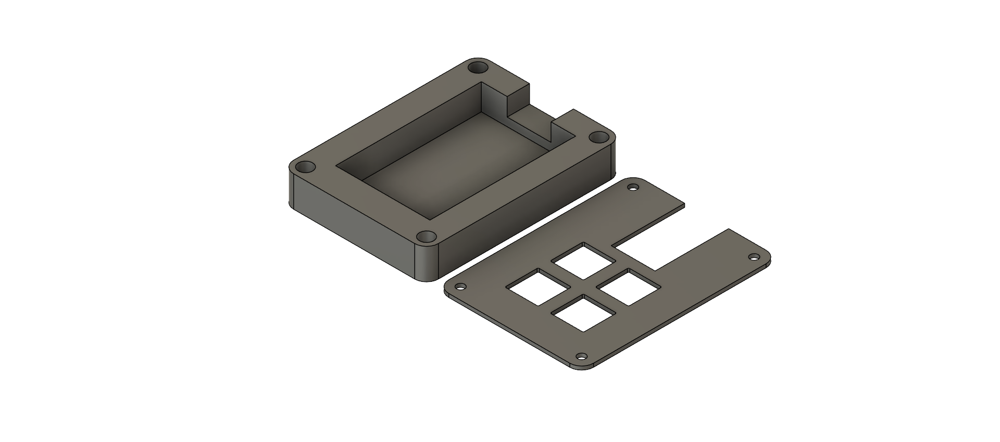

# MyMacropad

A 4–key macropad based on a **Seeed Studio XIAO RP2040**, designed for quick shortcuts on Windows 10: open a new browser tab, take screenshots, and launch Steam and Discord.

---

## Overall hackpad screenshot

Screenshot of the complete hackpad (assembled):

---

## Schematic screenshot

This is the electrical schematic used to wire the XIAO RP2040, switches and connectors:

---

## PCB screenshot

Top view of the custom PCB designed in KiCad:

---

## Case and fit

The macropad case is split into two main parts: a base and a top cover.  
They are provided as STEP files so they can be edited or re‑exported as STLs for 3D printing.

- `CAD/macropad.step` – full assembly of the case.  
- `CAD/Macropad_top.step` – separate top piece.

The image below shows the overall case geometry and how the plate and switches fit inside:

---

## Bill of Materials (BOM)

| Qty | Part                              | Notes                                      |
|-----|-----------------------------------|--------------------------------------------|
| 1   | Seeed Studio **XIAO RP2040**      | Main microcontroller board                 |
| 4   | Mechanical key switch (MX style)  | Any MX‑compatible switch                   |
| 4   | Keycaps                           | MX‑compatible                              |
| 1   | Custom PCB (MACROPAD.kicad_pcb)   | From `PCB/` folder                         |
| 1   | 3D printed case (base + top)      | From `CAD/macropad.step` / `Macropad_top.step` |
| 4   | M3 screws (and inserts, optional) | For mounting the case                      |
| —   | Wire / headers                    | If hand‑wiring or socketing the XIAO       |
